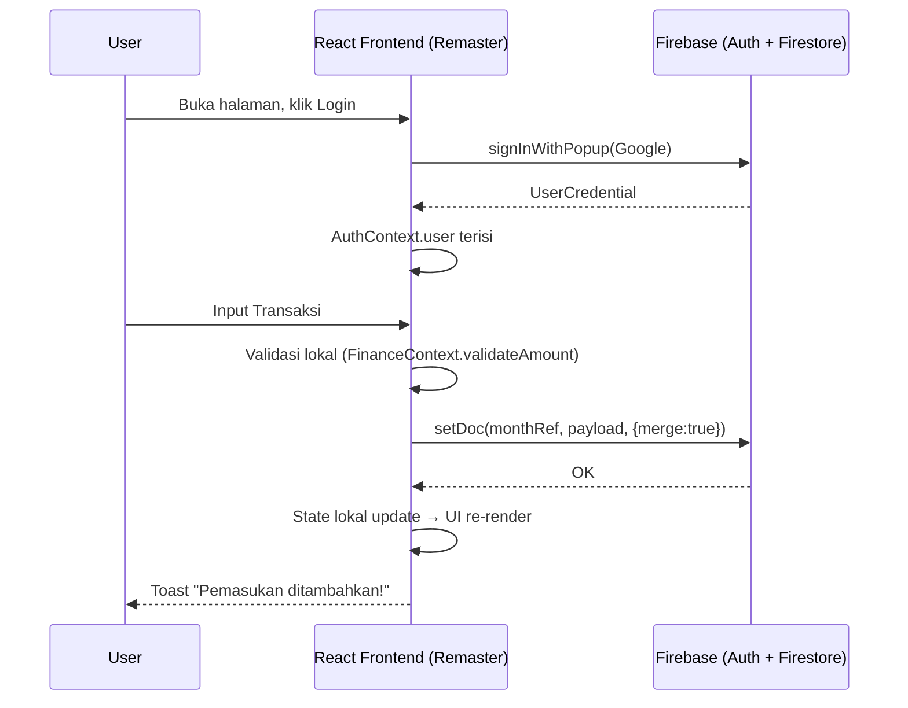
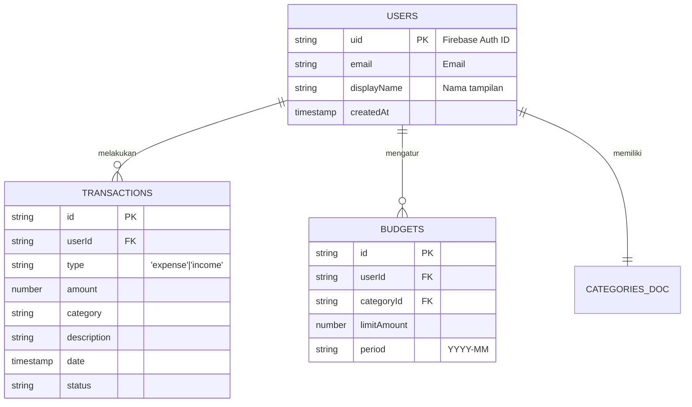

# PRD — Finance Dashboard

> **Product Requirements Document**
> Versi: 2.0 (post-remaster)
> Status: Aktif — fase integrasi React/Firestore & hardening keamanan.

---

## 1. Ringkasan Produk

**Finance Dashboard** adalah aplikasi *personal finance* berbasis web yang membantu pengguna memantau kondisi keuangan bulanan mereka — pemasukan, pengeluaran, anggaran, dan rasio tabungan — melalui satu tampilan ringkas dengan grafik dan tabel interaktif.

Aplikasi ini merupakan **remaster** dari versi lama (vanilla JS + HTML + CSS) menjadi stack baru berbasis **React 19 + Vite + Tailwind CSS** dengan **Firebase Authentication + Firestore** sebagai backend (BaaS). Versi lama tetap berada di folder `public/` untuk referensi historis dan akan dihapus setelah transisi sepenuhnya.

**Nilai utama yang ditawarkan:**
- Pelacakan pemasukan/pengeluaran bulanan yang cepat dengan kategori kustom.
- Deteksi visual (warna) untuk *overspend* / *underspend* terhadap anggaran.
- Indikator **Rasio Tabungan** (pengeluaran vs pemasukan) yang berubah warna otomatis.
- Riwayat multi-bulan dengan navigasi prev/next yang ringan.
- Multi-user: data tiap pengguna terisolasi penuh lewat UID.
- Akses lintas-perangkat otomatis karena data tersimpan di Firestore.

---

## 2. Tujuan & Sasaran

| Tujuan | Metrik Keberhasilan |
|---|---|
| Migrasi penuh dari vanilla JS ke React + Vite | Build `remaster/dist` menggantikan output `public/` di hosting. |
| Integrasi React ↔ Firestore dengan multi-user aman | 0 cross-user data leak; rules valid untuk semua skenario CRUD. |
| Hardening keamanan pasca-audit | Kerentanan `firestore.rules` tertutup, App Check aktif, dependency audit bersih. |
| UX yang konsisten di desktop & mobile | Tidak ada layout overflow pada lebar 360px – 1920px. |
| Operasional hands-off | Deploy otomatis ke Firebase Hosting tiap push ke `main`/`remaster`. |

---

## 3. Personas & Use Cases

### Persona
- **Individu yang mengelola keuangan pribadi** (single-owner per akun). Ingin lihat Health-Check bulanan dalam 5 detik tanpa login berulang.
- **Pasangan/keluarga kecil** yang ingin data terbagi antar perangkat untuk satu akun Google.
- **Kontributor open-source** yang akan memperluas fitur (budget templates, ekspor CSV, dll.).

### Use Cases Inti
1. Login dengan akun Google → masuk ke Dashboard bulan berjalan.
2. Menambahkan pemasukan/pengeluaran dengan kategori (default + custom) dan nominal.
3. Mengatur limit anggaran per kategori; UI menandai status *over/below*.
4. Berpindah antar bulan untuk membandingkan tren.
5. Mengaktifkan tema gelap/terang sesuai preferensi.
6. Mengakses aplikasi dari perangkat berbeda dengan data yang konsisten.

---

## 4. Fitur Inti

### 4.1 Autentikasi
- Login via **Google Sign-In (popup)** menggunakan `signInWithPopup`.
- Session persistence via Firebase Auth (default local).
- **Auto-logout idle 30 menit** di sisi klien (`SessionManager` listens to `mousemove/keydown/scroll/click/touchstart`).
- Halaman `/login` terlindungi redirect balik ke `/` saat user sudah auth.

### 4.2 Dashboard
- **KPI ringkas** dalam grid: total income, total expense, selisih, rasio tabungan.
- **Pie chart** distribusi pengeluaran per kategori (`recharts`).
- **Tabel interaktif** untuk income & expense (sort, search, quick-toggle status).
- **Tombol tambah cepat** (quick add) untuk income/expense.

### 4.3 Manajemen Transaksi
- CRUD lengkap untuk **Income** (`IncomePage`) dan **Expense** (`ExpensePage`).
- Field wajib: amount (number > 0), tanggal, kategori.
- Status `done` / `planned` pada expense (toggle).
- Validasi nominal: harus `number`, `0 < amount ≤ 1.000.000.000.000`.
- Toast feedback (`react-hot-toast`) untuk setiap aksi CRUD.

### 4.4 Anggaran (Budget)
- Set limit bulanan per kategori (`BudgetPage`).
- Auto-merge ke `months/{YYYY-MM}.budgets` lewat Firestore `setDoc({ merge: true })`.
- Indikator visual: hijau (≤80%), kuning (81–100%), merah (>100%).

### 4.5 Laporan (Reports)
- Aggregasi lintas-bulan: query `collection(db, 'users', uid, 'months')`.
- Visualisasi tren income vs expense (multi-bulan).
- Rekap total per kategori tahunan.

### 4.6 Kategori Kustom
- CRUD kategori expense (`FinanceContext`).
- Field: `name`, `color` (react-colorful), `icon` (lucide-react).
- Kategori bawaan (`isDefault: true`) tidak dapat dihapus.

### 4.7 Tema
- Light/Dark mode toggle.
- Preferensi tersimpan di `localStorage`; diterapkan ke `<html>` dan `<body data-theme>`.

---

## 5. User Flow

```
[Buka Aplikasi]
        │
        ├── Tidak login → /login (tombol "Masuk dengan Google")
        │       │
        │       └── Popup Google Auth → success → Toast "Login Berhasil"
        │
        └── Login → /  (Dashboard)
                │
                ├── Lihat KPI / Pie / tabel bulan berjalan
                ├── Navigasi prev/next month
                ├── Klik "Pemasukan" / "Pengeluaran" / "Anggaran" / "Laporan"
                ├── Tambah/edit/hapus transaksi
                │       │
                │       └── Toast konfirmasi; state lokal & Firestore ter-update
                │
                └── Idle 30 menit → auto-logout + Toast "Sesi berakhir"
```

---

## 6. Arsitektur & Tech Stack

### 6.1 Arsitektur
**Serverless (BaaS)** — tidak ada server/API layer tambahan. React Frontend adalah otak presentasi; Firebase Auth & Firestore adalah backend.



### 6.2 Tech Stack

| Layer | Teknologi |
|---|---|
| **UI Framework** | React 19 + Vite 7 |
| **Routing** | React Router v7 (`/`, `/income`, `/expenses`, `/budget`, `/reports`, `/login`) |
| **Styling** | Tailwind CSS v4 + PostCSS + Autoprefixer |
| **Animations** | Framer Motion |
| **Charts** | Recharts |
| **Icons** | Lucide React |
| **Toasts** | react-hot-toast |
| **Color Picker** | react-colorful |
| **Auth** | Firebase Auth (Google provider) |
| **DB** | Cloud Firestore |
| **Bot Protection** | Firebase App Check (reCAPTCHA v3) — opsional via `VITE_RECAPTCHA_SITE_KEY` |
| **Hosting** | Firebase Hosting |
| **CI/CD** | GitHub Actions (`.github/workflows/firebase-hosting.yml`) |
| **Lint** | ESLint v9 (React Hooks + React Refresh) |

### 6.3 Folder Layout

```
finance-dashboard/
├── public/                       # Vanilla JS versi lama (legacy, akan dihapus)
│   ├── index.html
│   ├── login.html
│   ├── auth.js                   # Legacy auth
│   ├── firebase-core.js
│   ├── firebase-config.js
│   ├── session-manager.js
│   ├── data/repositories.js
│   ├── services/firebase.js
│   ├── state/{app-state,derivations}.js
│   ├── views/{expenses,budgets}.js
│   └── ui/{workflows,modals}.js
│
├── remaster/                     # React app — SOURCE OF TRUTH aktif
│   ├── index.html                # SPA entry
│   ├── package.json
│   ├── vite.config.js            # base: '/'
│   ├── tailwind.config.js
│   ├── postcss.config.js
│   ├── eslint.config.js
│   ├── .env.example              # Template env vars
│   └── src/
│       ├── main.jsx
│       ├── App.jsx               # Router + SessionManager + ProtectedRoute
│       ├── App.css
│       ├── index.css
│       ├── firebase-config.js    # Multi-source config resolver
│       ├── lib/firebase.js       # initializeApp, App Check init
│       ├── context/
│       │   ├── AuthContext.jsx
│       │   └── FinanceContext.jsx
│       ├── components/
│       │   ├── Layout.jsx        # Sidebar + topbar + mobile nav
│       │   ├── Cards.jsx         # StatCard, ChartCard
│       │   ├── Modal.jsx
│       │   ├── ScrollToTop.jsx
│       │   ├── CustomInputs.jsx
│       │   └── FullscreenTable.jsx
│       ├── pages/
│       │   ├── LoginPage.jsx
│       │   ├── DashboardPage.jsx
│       │   ├── IncomePage.jsx
│       │   ├── ExpensePage.jsx
│       │   ├── BudgetPage.jsx
│       │   └── ReportsPage.jsx
│       └── utils/formatter.js    # formatRupiah
│
├── firestore.rules               # SECURITY RULES (sumber otorisasi tunggal)
├── firestore.indexes.json
├── firebase.json                 # Hosting config (public -> hosting target)
├── .firebaserc                   # Default project: finance-dashboard-10nfl
├── .github/workflows/firebase-hosting.yml
└── README.md
```

---

## 7. Database Schema (Firestore)

### 7.1 Path Structure

```
users/{uid}/                          ← Document user (root data)
  ├── (root doc opsional: profile)
  ├── categories/main                 ← Doc berisi array `categories`
  ├── months/{YYYY-MM}                ← 1 doc per bulan
  │     ├── incomes:   Array<IncomeItem>
  │     ├── expenses:  Array<ExpenseItem>
  │     └── budgets:   { [categoryId]: number }
  ├── templates/{templateId}          ← (reserved) recurring templates
  └── migration/{migrationId}         ← (reserved) migrasi data
```

### 7.2 Entity Schemas

**User document (`users/{uid}`)** — saat ini hanya sebagai namespace.
Profile lengkap mengikuti `request.auth` dari Firebase Authentication.

**Categories document (`users/{uid}/categories/main`):**
| Field | Type | Keterangan |
|---|---|---|
| `categories` | `Array<Category>` | Daftar kategori expense |

**Category object:**
| Field | Type | Constraint |
|---|---|---|
| `id` | string | slugified, unique |
| `name` | string | max 50 char, wajib |
| `color` | string | hex color (default `#94A3B8`) |
| `icon` | string | nama Lucide icon |
| `isDefault` | boolean | `true` untuk bawaan (tidak bisa dihapus) |

**Month document (`users/{uid}/months/{YYYY-MM}`):**
| Field | Type | Keterangan |
|---|---|---|
| `incomes` | `Array<IncomeItem>` | |
| `expenses` | `Array<ExpenseItem>` | |
| `budgets` | `Record<string, number>` | key = categoryId, value = limit |

**IncomeItem:**
| Field | Type | Constraint |
|---|---|---|
| `id` | string | uuid |
| `source` | string | max 100 char |
| `description` | string | max 255 char |
| `amount` | number | > 0, ≤ 1e12 |
| `date` | Timestamp | tanggal transaksi |

**ExpenseItem:**
| Field | Type | Constraint |
|---|---|---|
| `id` | string | uuid |
| `category` | string | categoryId |
| `description` | string | max 255 char |
| `amount` | number | > 0, ≤ 1e12 |
| `date` | Timestamp | tanggal transaksi |
| `status` | string | `done` / `planned` |
| `isRecurring` | boolean | reserved |

### 7.3 ERD



---

## 8. Security Model

Karena arsitektur **serverless**, **Firestore Security Rules** adalah satu-satunya otoritas backend.

### 8.1 Aturan Inti (`firestore.rules`)
- Default deny untuk semua path.
- Setiap akses harus `request.auth != null` **AND** `request.auth.uid == userId`.
- Validasi tipe data: `amount is number`, `0 <= amount <= 1e12` (`isValidAmount` helper).
- Validasi shape dokumen:
  - `users/{uid}/categories/main`: hanya field `categories`; setiap Category object hanya punya field `[id, name, color, icon, isDefault]` (whitelist via `hasOnly`).
  - `users/{uid}/months/{YYYY-MM}`: hanya field `[incomes, expenses, budgets]` (whitelist via `hasOnly`); `incomes`/`expenses` harus `list`; `budgets` adalah `map` dengan setiap value bertipe `number` valid.
- Budget **allow 0** untuk reset budget (backward-compat dengan data existing).
- Income/Expense items **TIDAK divalidasi element-by-element** di rules — validasi ada di client (`FinanceContext.validateAmount`). Alasan: Firestore rules tidak efisien untuk deep validation dan biayanya tinggi.
- `users/{uid}` root document: read OK, write **deny**.
- `templates/*` & `migration/*`: read OK, write **deny** (reserved untuk fitur masa depan).
- Catch-all untuk subcollection masa depan di bawah `/users/{uid}`: read OK, write **deny** — harus di-explicit-kan saat menambah subcollection baru (lihat AGENTS.md Section 2.1).

### 8.2 Firebase App Check
- Inisialisasi otomatis di `lib/firebase.js` jika `VITE_RECAPTCHA_SITE_KEY` di-set.
- `isTokenAutoRefreshEnabled = true`.
- Di dev mode, debug token otomatis diaktifkan untuk emulator.
- **Status:** `VITE_RECAPTCHA_SITE_KEY` belum di-set di production. Belum aktif (lihat backlog Section 12.1).

### 8.3 Konfigurasi Firebase
- **Resolution order**: Vite env vars → `window.__FIREBASE_CONFIG__` → `<meta name="firebase-config">` → `https://<site>/__/firebase/init.json` → `LEGACY_FALLBACK_CONFIG` (hardcoded, dengan `console.error` audit log — lihat AGENTS.md Section 2.2).
- API key "public" (sesuai desain Firebase Web), tetapi **tidak boleh di-hardcode sebagai fallback utama**; pakai runtime config atau `.env`.

### 8.4 Session
- Auto-logout 30 menit idle di sisi klien (UX saja, **bukan** kontrol keamanan).
- Validasi sesi nyata terjadi di Firebase Auth (token expiration).

---

## 9. Non-Functional Requirements

| Aspek | Target |
|---|---|
| **Performance** | First Contentful Paint < 2s di broadband standar. Bundle terkompresi gzip < 500KB. |
| **Availability** | SLA mengikuti Firebase (99.95%). |
| **Scalability** | Bebas skala karena Firestore auto-scale. |
| **Compatibility** | Chrome, Edge, Safari, Firefox versi 2 tahun terakhir. Mobile browser iOS/Android. |
| **i18n** | Bahasa Indonesia (saat ini); struktur siap untuk i18n. |
| **Accessibility** | Kontras teks minimum WCAG AA; kontrol fokus keyboard untuk semua aksi utama. |
| **Privacy** | Tidak ada data pengguna yang dikirim ke pihak ketiga selain Firebase. |

---

## 10. CI/CD & Deployment

### 10.1 Alur CI (`.github/workflows/firebase-hosting.yml`)
Trigger: push ke `main` atau `remaster`, atau `workflow_dispatch`, atau pull_request ke branch tersebut.

Step urutan:
1. **Security audit** — `npm audit --audit-level=high` (gate CVE).
2. **Run unit tests** — `npm test` (Vitest, lihat Section 11.3).
3. **Build project** — `vite build` + copy dist → `public/`.
4. **Deploy Firestore Rules** — via `scripts/deploy-firestore-rules.sh` (REST API firebaserules.googleapis.com). Bypass `firebase deploy` karena butuh `serviceusage.services.get` permission. Kalau step ini gagal, log warning tapi workflow tetap lanjut.
5. **Deploy to Firebase Hosting** — `firebase deploy --only hosting`.
6. **Publish deployment summary** — URL + channel info ke GitHub Actions summary.
7. **Clean up credentials** — `shred --remove` pada service account temp file.

Untuk pull_request: step 1-3 berjalan sebagai gate, step 4-7 di-skip (tidak ada deploy).

**Catatan rules deploy:** Kalau CI deploy rules gagal (HTTP 4xx/5xx dari REST API), deploy manual dari workstation lokal:
```bash
firebase deploy --only firestore:rules --project finance-dashboard-10nfl
```

Langkah:
1. Checkout repo.
2. Setup Node.js 20.
3. Tulis `FIREBASE_SERVICE_ACCOUNT` secret ke file sementara.
4. `npm install -g firebase-tools`.
5. `npm audit --audit-level=high` di `remaster/` (gate keamanan).
6. `npm ci --legacy-peer-deps && npm run build` di `remaster/`.
7. Hapus `public/` lama, salin `remaster/dist/*` ke `public/`.
8. `firebase deploy --only hosting --project finance-dashboard-10nfl`.
9. Publish run summary (deploy URL, channel, console URL).
10. Cleanup credentials dengan `shred --remove`.

### 10.2 Hosting target**`public/`** — selalu berisi output build React terbaru.
- URL produksi: `https://finance-dashboard-10nfl.web.app`
- Rewrites `** → /index.html` untuk SPA routing.

### 10.3 Deployment ke Firestore Rules
- **Status (Fase 1):** Workflow `.github/workflows/firebase-hosting.yml` sekarang punya step `Deploy Firestore Rules and Indexes` sebelum deploy hosting. Service account yang dipakai sudah punya role `Firebase Hosting Admin` + `Firebase Rules Admin`. Setiap push ke `main`/`remaster` → rules & indexes otomatis ter-deploy.
- **Verifikasi pasca-deploy:** Buka Firebase Console → Firestore → Rules, bandingkan dengan `firestore.rules` di repo. Pantau Firebase logs untuk permission-denied errors.
- **Testing lokal:** `firebase emulators:start` (perlu `firebase-tools` ter-install). Wajib dijalankan untuk perubahan rules yang signifikan (lihat AGENTS.md Section 4.6).

---

## 11. Persyaratan Operasional

### 11.1 Secrets yang Harus Diset di Repo
| Secret | Tujuan |
|---|---|
| `FIREBASE_SERVICE_ACCOUNT` | JSON service account Firebase Hosting Admin + Rules Admin. |

### 11.2 Environment Variables (`remaster/.env`)
| Var | Wajib? | Keterangan |
|---|---|---|
| `VITE_FIREBASE_API_KEY` | untuk non-hosting local | fallback chain sudah mencakup ini |
| `VITE_FIREBASE_AUTH_DOMAIN` | ya (kalau bukan hosting) | |
| `VITE_FIREBASE_PROJECT_ID` | ya (kalau bukan hosting) | |
| `VITE_FIREBASE_STORAGE_BUCKET` | opsional | |
| `VITE_FIREBASE_MESSAGING_SENDER_ID` | opsional | |
| `VITE_FIREBASE_APP_ID` | ya (kalau bukan hosting) | |
| `VITE_FIREBASE_MEASUREMENT_ID` | opsional | |
| `VITE_RECAPTCHA_SITE_KEY` | opsional | untuk App Check |

### 11.3 Local Development
```bash
# di remaster/
npm install
npm run dev          # vite dev server
npm run build        # produksi build
npm run lint         # eslint
npm run preview      # preview hasil build
npm test             # vitest run (sekali)
npm run test:watch   # vitest watch mode
npm run test:coverage # vitest + coverage

# root repo (kalau pakai emulator)
firebase emulators:start
```

### 11.4 Test Coverage (Fase 6)
- **Framework**: Vitest 5 dengan environment jsdom.
- **File test**:
  - `src/utils/dates.test.js` — extractDate, parseDateString, formatDateIdLong, parseDateToMs, getMonthKey, MONTH_NAMES_ID/LONG.
  - `src/utils/validators.test.js` — validateAmount, validateBudgetAmount (boundary cases).
  - `src/lib/iconMap.test.js` — IconMap integrity, getIcon fallback.
  - `src/test/firestore.rules.test.js` — static analysis (brace balance, security invariants, helper functions, collection validation).
- **CI**: `npm test` di workflow `.github/workflows/firebase-hosting.yml` (gate untuk push ke `main`/`remaster` dan pull_request).
- **Dependabot**: `.github/dependabot.yml` untuk npm (weekly) + GitHub Actions. Major update untuk react, firebase, vite, vitest, react-router di-ignore (perlu review manual).
- **Batas cakupan**: `vitest.config.js` saat ini hanya mengukur coverage untuk `src/utils/` dan `src/lib/`. Untuk perluasan ke components/context, lihat backlog Section 12.

---

## 12. Backlog & Risiko

### 12.1 Backlog Teknis (Prioritas)
1. ~~Tambah deploy Firestore Rules di workflow CI (kritis)~~ ✅ Selesai (Fase 1.2).
2. ~~Audit & fix `npm audit` high/critical (tinggi)~~ ✅ Selesai (Fase 1.3).
3. ~~Hapus/audit `dangerouslySetInnerHTML` jika ada di React pages~~ ✅ Tidak ada usage di React (verified).
4. ~~Hapus `FALLBACK_CONFIG` hardcode di `public/firebase-config.js` dan `remaster/src/firebase-config.js`~~ ✅ Rename + audit (Fase 2.2); targeted removal menyusul.
5. ~~Hapus folder `public/` legacy dari main branch~~ ✅ Selesai (Fase 2.1).
6. ~~Validasi tipe data di `firestore.rules` (shape validation)~~ ✅ Selesai (Fase 4).
7. **Aktifkan Firebase App Check di production** (sedang). Daftar reCAPTCHA v3 site key, set sebagai secret, inject ke build.
8. ~~Tambah unit/E2E test (Vitest + Playwright) untuk FinanceContext dan rules (Fase 6)~~ ✅ Selesai sebagian: Vitest setup + 66 test (utils, lib, rules static). Playwright E2E untuk component testing menyusul.
9. **Ekspor CSV/PDF** untuk Reports.
10. **Recurring templates** (cadangan `users/{uid}/templates/`) untuk transaksi berulang bulanan.
11. **i18n** — pisahkan string UI ke dictionary.
12. **Coverage expansion** — perbesar cakupan ke `src/components/` dan `src/context/` (saat ini hanya `utils/` + `lib/`).

### 12.2 Risiko
- **Rules drift**: jika rules tidak sinkron dengan kode, kontrol akses bisa hilang tanpa terdeteksi.
- **Dependency vulnerable**: `react-router`, `websocket-driver`, `protobufjs` punya advisory aktif — wajib `npm audit` berkala.
- **Hardcoded fallback API key**: walau "public", fallback membuat rotasi kunci Firebase sulit.
- **Session manager kosmetik**: tidak boleh dianggap kontrol keamanan; perlu server-side enforcement untuk skenario sensitif.

---

## 13. Acceptance Criteria (Rilis Stabil v1)
- [x] React app ter-deploy dari hasil build `remaster/` di Firebase Hosting.
- [x] Login Google berfungsi end-to-end.
- [x] CRUD income/expense/budget tersinkron ke Firestore.
- [x] Rasio tabungan & pie chart tampil benar.
- [x] Responsif di mobile & desktop.
- [x] Firestore rules memvalidasi `uid == userId` untuk setiap path user.
- [ ] `npm audit` clean dari kerentanan high/critical.
- [ ] App Check aktif di production.
- [ ] Folder `public/` legacy dihapus dari main.

---

## Lampiran A — Glosarium

| Istilah | Arti |
|---|---|
| **BaaS** | Backend-as-a-Service (Firebase). |
| **Month Key** | Format `YYYY-MM` yang jadi ID dokumen `months/{key}`. |
| **UID** | User ID dari Firebase Authentication. |
| **App Check** | Layanan Firebase untuk membuktikan request berasal dari app asli. |
| **SessionManager** | Komponen React yang mengelola auto-logout idle. |
| **ProtectedRoute** | Wrapper route yang men-redirect ke `/login` bila user belum auth. |

---

*Dokumen ini adalah PRD resmi. Perubahan besar pada fitur atau arsitektur wajib direview dan update dokumen ini.*