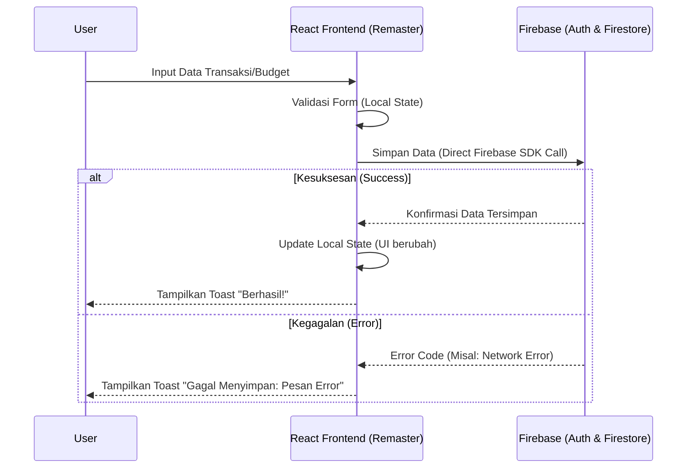
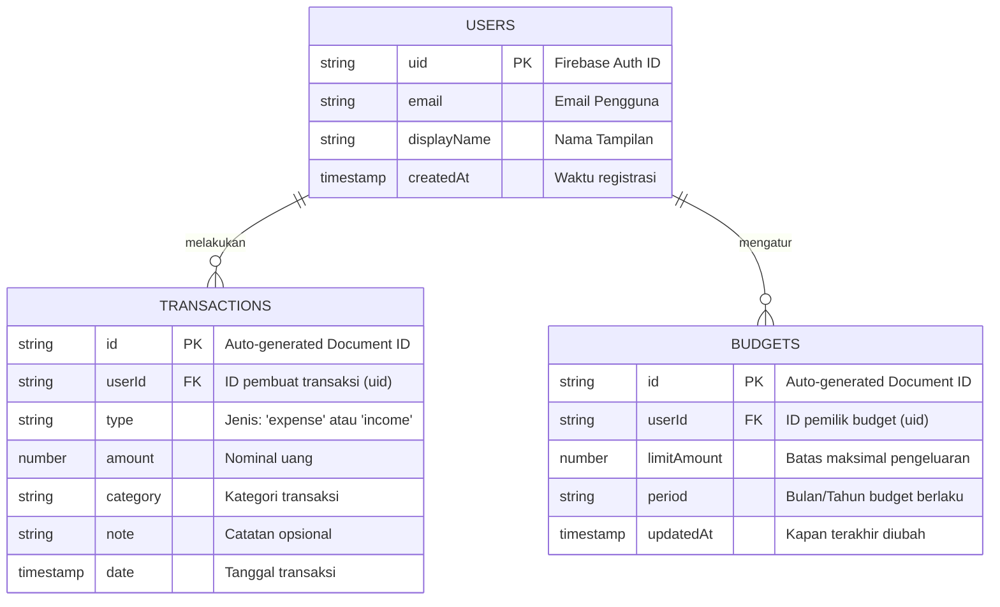

# PRD — Project Requirements Document

## 1. Overview
Aplikasi **Finance Dashboard** sedang dalam tahap pembaruan (remaster). Antarmuka pengguna (UI) yang sebelumnya dibangun dengan HTML, CSS, dan Vanilla JS kini telah berhasil diperbarui menggunakan teknologi modern (React JS, Vite, dan Tailwind CSS) pada folder `/remaster/`. 

Tujuan utama dari fase proyek ini adalah **mengintegrasikan UI baru tersebut dengan backend Firebase yang sudah ada**. Integrasi ini akan dilakukan dengan memigrasikan logika dari struktur lama (`/public/`) ke struktur baru secara bertahap, memastikan pencatatan pengeluaran (expenses), pemasukan (incomes), dan anggaran (budgets) dapat dihitung dengan akurat sesuai dengan masing-masing pengguna (Multi-user ready). 

## 2. Requirements
- **Strategi Migrasi (Bertahap Per Modul):** Pemindahan fungsi tidak dilakukan sekaligus, melainkan difokuskan satu per satu pada modul prioritas (`expenses`, `budget`, lalu `workflow`).
- **State Management:** Menggunakan *Local State* bawaan React (seperti `useState` dan `useEffect`) untuk menjaga aplikasi tetap ringan dan sederhana tanpa library tambahan yang kompleks.
- **Pola Firebase (Direct Call):** Komponen React akan langsung memanggil Firebase SDK (Firestore & Auth) tanpa melalui lapisan API tambahan (Serverless approach).
- **Penanganan Eror (Error Handling):** Menampilkan *Toast Notification* (notifikasi popup kecil yang hilang otomatis) di layar setiap kali ada aktivitas berhasil, gagal, atau eror saat berinteraksi dengan database.
- **Keamanan Data:** Setiap perhitungan pengeluaran dan pemasukan akan difilter secara ketat berdasarkan ID Pengguna (*User ID*) yang sedang login.

## 3. Core Features
Berdasarkan pemetaan file sistem lama, berikut adalah fitur utama yang akan dimigrasikan ke React:
1. **Sistem Autentikasi (Autentikasi Firebase):** Login, Register, dan Logout pengguna. Memigrasikan fungsi dari `auth.js` dan konfigurasi `firebase-core.js`.
2. **Kalkulasi Transaksi (Expenses & Incomes):** Fitur untuk mencatat, mengedit, menghapus, dan menghitung total pengeluaran dan pemasukan pengguna. Memigrasikan fungsi dari `expenses.js`.
3. **Manajemen Anggaran (Budgeting):** Fitur bagi pengguna untuk menetapkan batas pengeluaran (budget) bulanan atau mingguan. Memigrasikan fungsi dari `budget.js`.
4. **Aliran Kerja Dashboard (Workflow UI):** Menampilkan rangkuman finansial, grafik riwayat, dan interaksi layar utama. Memigrasikan fungsi dari `workflow.js` & `repositories.js` (hanya repository yang dibutuhkan secara lokal).

## 4. User Flow
1. **Mulai Aplikasi:** Pengguna membuka aplikasi dan diarahkan ke halaman Login/Register jika belum memiliki sesi aktif.
2. **Proses Login:** Firebase memvalidasi akun. Jika sukses, muncul notifikasi (Toast) "Login Berhasil" dan pengguna diarahkan ke Dashboard.
3. **Melihat Dashboard:** Frontend mengambil data transaksi dari Firebase (Direct Call berdasar ID Pengguna), lalu *Local State* React akan memproses dan menampilkan statistik pada layar.
4. **Menambah Transaksi/Budget:** Pengguna mengisi form Pengeluaran di UI. Saat ditekan 'Simpan', React mengirim data langsung ke Firebase Firestore.
5. **Umpan Balik (Feedback):** Jika data tersimpan, notifikasi Toast "Pengeluaran ditambahkan" muncul, state lokal diperbarui, dan angka di layar otomatis berubah tanpa perlu menekan *refresh* (muat ulang halaman).

## 5. Architecture
Aplikasi ini menggunakan arsitektur **Serverless** berbasis komponen (Direct Call). React Frontend berfungsi sebagai otak presentasi dan logika interaksi, sedangkan Firebase bertindak sebagai Backend-as-a-Service (BaaS).

## 6. Database Schema
Untuk tahap "Optimasi Ringan" ini, skema NoSQL di Firestore akan distrukturkan agar perhitungan pengeluaran setiap pengguna dan *query* dapat dilakukan lebih efisien. Daripada memisah pengeluaran dan pemasukan dalam banyak tabel, keduanya digabung ke dalam koleksi spesifik.

**Koleksi Utama di Firestore:**
1. `Users` - Menyimpan profil pengguna.
2. `Transactions` - Menyimpan seluruh pengeluaran (expense) dan pemasukan (income).
3. `Budgets` - Menyimpan target batas pengeluaran pengguna.

## 7. Tech Stack
Berikut adalah teknologi yang direkomendasikan dan akan digunakan berdasarkan fondasi proyek berjalan yang paling cocok dengan kebutuhan "remaster" dan "optimasi ringan":

- **Frontend:** React JS (komponen UI interaktif) + Vite (build tool yang sangat cepat).
- **Styling:** Tailwind CSS (untuk mendesain tampilan secara responsif dengan cepat).
- **Backend & Database:** Firebase Firestore (Database NoSQL real-time berbasis dokumen).
- **Authentication:** Firebase Auth (Menangani login via Email/Password atau Google).
- **Deployment:** Firebase Hosting (untuk kemudahan rilis dan integrasi dengan ekosistem Firebase).
- **Library Tambahan:** `react-hot-toast` atau `react-toastify` (Untuk membungkus notifikasi *Toast Error Handling* dengan mudah).